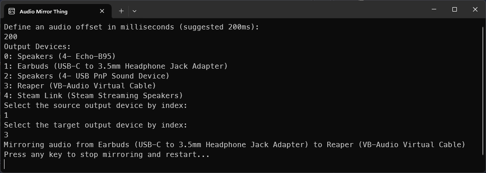

# Audio Mirror Thing

This here doohickey simply mirrors one output device to another using Wasapi cause I was tired of using SteamVR purely to mirror audio devices

## Developing

1. Clone the repository.
2. Open the solution in Visual Studio.
3. Build and run the project.

## Contributing

Pull requests are welcome. For major changes, please open an issue first to discuss what you would like to change.

## License

[MIT](https://github.com/Umbranoxio/cocoa-sync/blob/main/LICENSE.txt)
